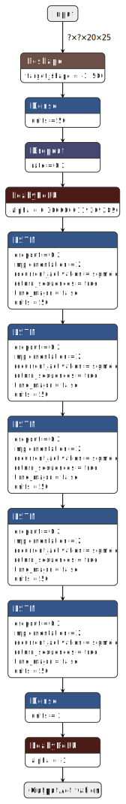

# open-neural-apc

## Introduction
This repository contains my original implementation of an RNN-based APC (Automated Passenger Counting) system on the <a href="https://github.com/nicojahn/open-neural-apc/tree/original" target="_blank" rel="noopener noreferrer">'orignal'</a> branch. This was the subject of my bachelor thesis "Counting People on Image Sequences Using Recurrent Neural Networks" at the TU Berlin in the Neural Information Processing Group. A newer, more basic implementation in <a href="https://github.com/tensorflow/tensorflow" target="_blank" rel="noopener noreferrer">Tensorflow 2</a> is provided via the jupyter notebook. A pre-trained (maybe not optimal) model is delivered with a handful of test sequences. The bachelor thesis will be provided upon request.

## Which license is applied to the code?
BSD 3-Clause License

## What technologies are used?
* A <a href="https://github.com/tensorflow/tensorflow" target="_blank" rel="noopener noreferrer">Tensorflow 2</a> implementation of the ML model
* Memory-mapped files which contain the sequences
    * Provides faster access and more efficient memory handling compared to CSV/image files
* Configuration parser and close to complete parameterized code
* A visualization tool for investigation

## What to expect from such a model?
* The main problem which was solved with this model was an end-to-end ML algorithm
* It only needs single labels per sequences (e.g. count at the end of the sequences)
* The model works efficiently and can process sequences of a variety of lengths
    * Dataset has typically 100s to multiple 1000s of images per sequence
    * Uses 10 frames per second
* With the loss function, a property of the data was exploited
    * The problem is the exponential decreasing distribution of the labels (many easy cases, few hard cases)
    * We can combine sequences (concatenate them)
    * A sequences usually start and ends with the train door opening/closing respectively
    * The count can continue for further videos (sequences are independent, but we make them dependent)
* On average on this dataset the accuracy is somewhere above 95%

## Some validation examples:
* The right side contains the sequence which the model receives as input
    * Top-Down view of a depth-sensing sensor (20x25 pixel resolution)
    * Noisy sequence
    * The door is located on the bottom of the frames
* On the left side of the video, the neural-apc is shown in action
    * The top plot are the alighting passengers, bottom the boarding ones
    * The x-axis resembles the number of frames
    * The y-axis the count
    * The red dashed line on the top
        * Only label for the end of the sequence as upper bound for every intermediate frame
    * The blue dashed line on the bottom which raises in the end is the lower bound 
    * The gray line is the current progress of the video
    * The gray dashed line is just a helping projection of the current model count to the y-axis
    * The green line is the **raw output** of the model
 

You can find more GIFs of the validation sequences <a href="./results/gifs/" target="_blank" rel="noopener noreferrer">here</a>.

## What do the labels look like?
In short:
 * What we want is the green line (should be the ground truth and therefore, also our prediction)
 * We just have a label for the last frame of the video, but since the optimal counting function of each category is non-decreasing, we have a lower and upper bound (via the label)
 * We just learn from this bounding box the green line

## You told the loss function was special?
In my honest opinion, the model is rather boring, it was planned just as a basic model. You can see it at the bottom of this page (Visualized with <a href="https://github.com/lutzroeder/netron" target="_blank" rel="noopener noreferrer">Netron</a> by <a href="https://github.com/lutzroeder" target="_blank" rel="noopener noreferrer">Lutz Roeder</a>). The main selling point, the loss function, was chosen to avoid a weighting of classes. As previously mentioned the labels are (as usual) not well distributed. More than 75% of the >5000 labels (of ~2500 sequences) contained only 0,1 or 2 passengers. Luckily we can produce larger labels when concatenating sequences and therefore get larger counts. The drawback is the computational complexity when preparing batches and computing through the sequences. 
Visual representation of the concatenation and a synthetic prediction is shown below. Since the bounding boxes are the only knowledge we have, we can't apply a loss as long as the prediction is inside the boundaries. Only if the model predicts values outside the valid range or for the last frame of each sequence, we can compute an error. For the last frame we calculate an absolute loss. These are the only losses that are applied that rely on the labels. Auxillary losses were introduced by myself in 2020 in this repository.

## Training behaviour
There is this older version of the <a href="https://github.com/nicojahn/open-neural-apc/blob/7e9d452dec081e78161760bd7e2e50a62c41d009/Open-Neural-APC%20Notebook.ipynb" target="_blank" rel="noopener noreferrer">Notebook</a> that als contains the whole output of the training process. I have used a very verbose output in the training cell, so that one can image how fast/slow and acccurate the model trains.

## Basic model

